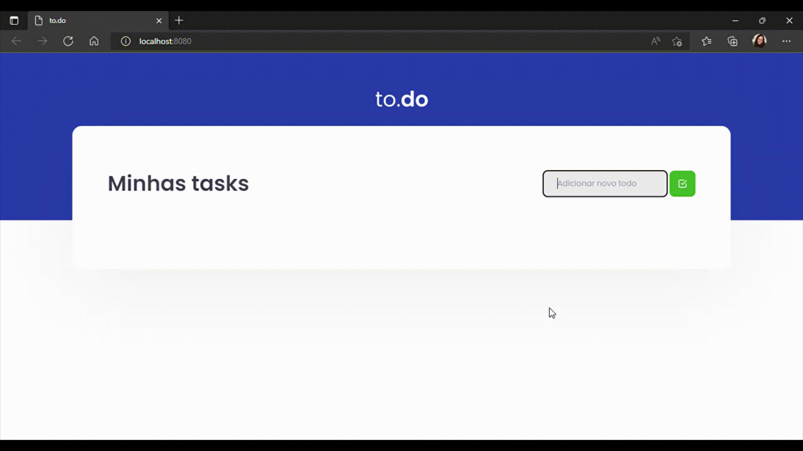

# 📚 Desafio 01 - Conceitos do React

> Esse é o desafio proposto no chapter I da trilha de React, cujo objetivo é treinar o que foi aprendido sobre manipulação do estado no React.
>
> _Status: concluído._



## ✅ Funcionalidades

- [x] Adicionar uma nova tarefa
- [x] Não permitir a inserção de uma tarefa em branco
- [x] Remover uma tarefa
- [x] Marcar e desmarcar uma tarefa como concluída

## 🚀 Tecnologias utilizadas

- ReactJS
- Testes com jest

## 💻 Como rodar

1. Clonar o repositório:

```bash
git clone git@github.com:lineavelino/ignite-desafio1-1.git
```

2. Entrar na pasta do repositório:

```bash
cd ignite-desafio1-1
```

3. Abrir no editor (manualmente ou pela linha de código, como no exemplo):

```bash
code .
```

4. Instalar as dependências:

```bash
yarn
```

5. Rodar o servidor:

```bash
yarn dev
```
